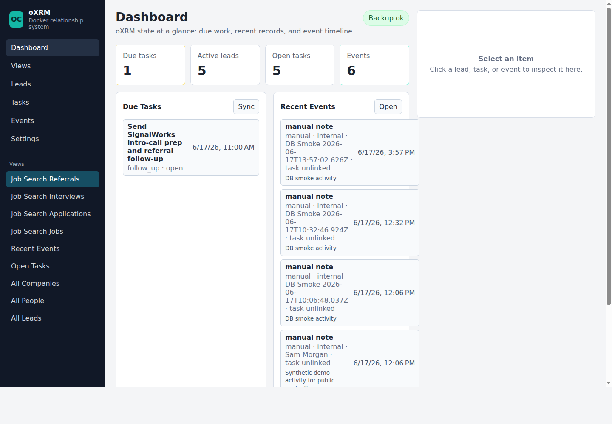

# oXRM

[](https://github.com/otcan/oxrm/actions/workflows/ci.yml)
[](LICENSE)
[](package.json)
[](docker-compose.yml)

Self-hosted outreach workspace for job search, customer outreach, partnerships,
and founder-led sales.

Run your outreach from your own machine. Keep contacts, companies,
applications, leads, notes, tasks, follow-ups, drafts, and activity history
under your control.

oXRM is for high-context outreach, not spam. It helps humans and agents manage
who to contact, what happened, what should happen next, and what needs approval.



## Who This Is For

- job seekers sending CVs and tracking applications
- founders doing customer discovery or sales outreach
- consultants managing warm leads and follow-ups
- agencies running high-context client outreach
- operators who want agents to help draft, organize, and update outreach state

## Start With Codex

The recommended first-run path is Codex-managed onboarding. Let Codex run the
repo setup and ask the job-search questions.

1. Install Codex for desktop. Download the desktop app first.
2. Create a new Project.
3. Copy and paste this prompt:

```text
Clone https://github.com/otcan/oxrm and set it up locally for job search.

Use Docker. Do not use real external credentials. Draft only: do not send
emails, LinkedIn messages, CVs, cover letters, applications, uploads, or
recruiter messages.

After cloning, read docs/start-with-codex.md,
docs/onboarding/job-search-setup.md, and docs/agent-job-search-loop.md.

Run:
./oxrm doctor
./oxrm init personal --template job-search --ports auto
./oxrm -i personal ready
./oxrm -i personal urls
./oxrm -i personal cli setup:job-search:next
./oxrm -i personal cli mcp:read oxrm://setup/job-search

Ask me the missing essentials: target roles, constraints, skills, exclusions,
base CV, cover-letter template, job sources, and daily review time.

Configure oXRM from my answers. Use only the job sources I named; do not add
example/template sources such as "Recruiter inbox" unless I explicitly ask.
Show the Web URL, readiness score, todos, warnings, next action, and first
three views. Stop after setup; do not apply or contact anyone.
```

The full prompt lives in
[docs/prompts/job-search-codex-onboarding.md](docs/prompts/job-search-codex-onboarding.md).

## Job Search Workflow

Use oXRM to track job sources, postings, fit calculations, applications, CV
versions, cover letters, recruiter contacts, communication history, phases, and
follow-up tasks.

```bash
./oxrm init --template job-search
./oxrm cli setup:job-search
./oxrm cli setup:job-search:get
./oxrm cli mcp:call xrm.run_view --input '{"key":"job_search.applications"}'
./oxrm cli mcp:read crm://queue/today
```

The job-search structure is XRM-native: job postings, job fits, applications,
CV versions, cover letters, communication ledger entries, and action
suggestions are records with relationships, tasks, events, and files.

Open `/setup/job-search` to configure sources, CV policy, cover-letter policy,
fit scoring, timers, and the agent playbook.

## Customer Outreach Workflow

Use oXRM to track sources, people, companies, leads, opportunities, message
drafts, approvals, outcomes, and follow-ups.

```bash
./oxrm init --template outreach
./oxrm cli mcp:call crm.search_leads --input '{"query":"founder"}'
./oxrm cli mcp:read crm://queue/today
```

Agents can read queues, inspect relationship history, propose next actions,
draft messages, and write audited notes/tasks. Humans still control sending,
approvals, and real external actions.

## What oXRM Stores

- XRM object types, records, dynamic fields, semantic field mappings, saved
  views, and record-to-record relationships
- people, companies, leads, applications, opportunities, tasks, files, drafts,
  approvals, and timeline events
- job-search templates for sources, job postings, job fits, CV versions, cover
  letters, phases, communication ledger entries, timers, and suggestions
- outreach templates for leads, opportunities, message drafts, follow-ups,
  outcomes, and suggested actions
- local backup metadata and optional GitHub backup artifacts

## What This Is Not

oXRM is not a spam tool, scraper, bulk sender, lead database, or Salesforce
clone.

It does not exist to automate low-quality mass outreach. It exists to help you
manage high-context outreach that still needs judgment.

## Self-Hosting

Normal usage runs through Docker:

```bash
./oxrm start
./oxrm ready
./oxrm seed job-search
./oxrm test
./oxrm urls
```

`./oxrm init` assigns local ports automatically. Print them with `./oxrm urls`:

```text
Web: http://127.0.0.1:<web-port>
API health: http://127.0.0.1:<api-port>/api/health
MCP health: http://127.0.0.1:<mcp-port>/health
```

`./oxrm ready` runs migrations and baseline seed only. Demo records are opt-in:

```bash
./oxrm seed job-search
./oxrm seed outreach
./oxrm seed none --reset-demo
```

Multiple instances are isolated by env file, Docker project name, ports, and
database volume:

```bash
./oxrm init client-a --template blank
./oxrm -i client-a urls
```

If ports or containers get into a bad state, use the repair flow before editing
files by hand:

```bash
./oxrm doctor
./oxrm ports repair
./oxrm repair
```

Use `./oxrm -i <instance> upgrade` for repeatable updates. It backs up, verifies
the latest artifact, migrates, seeds baseline configuration, restarts services,
and smoke-tests the instance. Local backups work without a GitHub token; set
`BACKUP_GITHUB_REPO` and `BACKUP_GITHUB_TOKEN` only when you want remote backup
pushes.

## MCP And API

MCP names remain stable for compatibility:

```bash
./oxrm cli health
./oxrm tools
./oxrm cli mcp:read crm://queue/today
./oxrm cli mcp:call crm.search_leads --input '{"query":"founder"}'
./oxrm cli mcp:call xrm.run_view --input '{"key":"job_search.applications"}'
```

The compatibility environment variables `CRM_API_URL` and `CRM_MCP_URL` are
still supported beside `OXRM_API_URL` and `OXRM_MCP_URL`.

## Docs

Start with [Start here](docs/start-here.md), [Onboarding](docs/onboarding.md), [Job search setup](docs/onboarding/job-search-setup.md), [Outreach setup](docs/onboarding/outreach-setup.md), and [XRM model](docs/xrm-model.md).
Assistant docs: [Agent job search loop](docs/agent-job-search-loop.md), [Codex demo](docs/codex-demo.md), and [MCP](docs/mcp.md).
Use cases: [Job search](docs/use-cases/job-search.md) and [Customer outreach](docs/use-cases/customer-outreach.md). Operations: [Live demos](docs/live-demos.md) and [Troubleshooting](docs/troubleshooting.md).

`./ocrm` is a deprecated compatibility wrapper around `./oxrm` for one release.
New automation should call `./oxrm`.

## License

MIT
